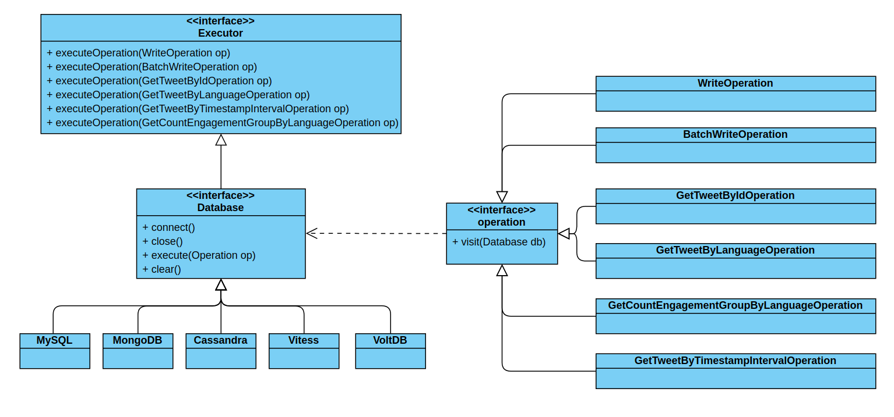
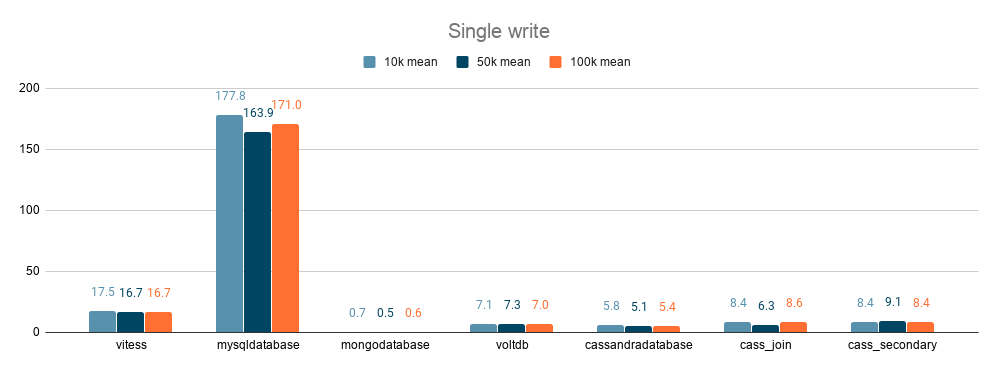
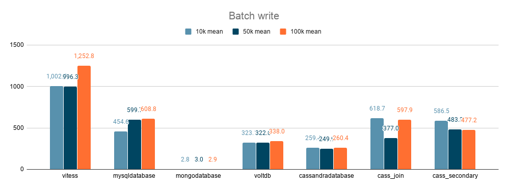
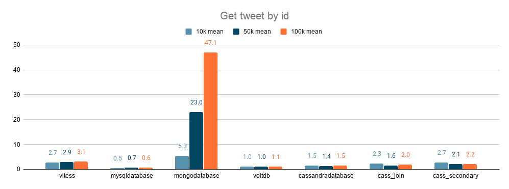
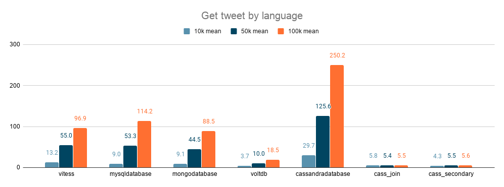
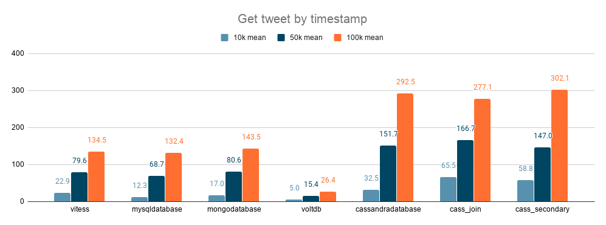
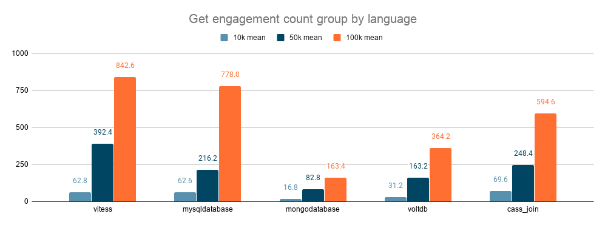

<p align="center">
  
</p>
<p align="center">
  <a href="http://recsys.deib.polimi.it">
    
  </a>
</p>

# PoliBench
Automated benchmarking framework for various DBMS solutions.

Table of Contents
=================

   * [PoliBench](#polibench)
      * [Introduction](#introduction)
      * [Databases](#databases)
         * [MySQL](#mysql)
         * [MongoDB](#mongodb)
         * [Cassandra](#cassandra)
         * [Vitess](#vitess)
         * [VoltDB](#voltdb)
      * [Data description](#data-description)
      * [Benchmark description](#benchmark-description)
         * [MySQL &amp; Vitess](#mysql--vitess)
         * [MongoDB](#mongodb-1)
         * [Cassandra](#cassandra-1)
         * [VoltDB](#voltdb-1)
      * [Setup](#setup)
      * [Requirements](#requirements)
         * [MySQL](#mysql-1)
         * [MongoDB](#mongodb-2)
         * [Cassandra](#cassandra-2)
         * [Vitess](#vitess-1)
         * [VoltDB](#voltdb-2)
      * [Results](#results)
      * [Authors](#authors)

## Introduction

Recently, the database research and development was very active, both in industry and in academia. This research progress initially caused a rejection of well-established concepts in the database area, like disk-oriented storage, strong guarantees, relational model, and SQL language (we will call these classical solutions as **SQL**), leading to a new category of DBMSs called **NoSQL**. These solutions (mainly developed in the 2000s) have usually heterogeneous data models, highly scalable architecture, and weakened consistency guarantees (usually they do not provide transactions) to improve performance. In recent years (mainly in the 2010s) though, research focused on providing full support for transactions with strong guarantees, while being horizontally scalable and having high performance. This resulted in a new DBMS category, called **NewSQL**.

This repository provides an automated benchmarking framework for various DBMS solutions called **PoliBench**. The DBMSs tested are from SQL, NoSQL, and NewSQL areas. The objective is to compare performances of highly heterogeneous solutions (SQL, NoSQL, and NewSQL databases were compared), to understand better the properties of each one and which types of workloads are ideal for each type of solution. This benchmark compared DBMSs deployed on a single node, therefore all the difficulties that could arise from a distributed database (like distributed concurrency control or replication consistency) are not considered.
A brief description of the DBMSs considered in this benchmark is given in the following.

## Databases

### MySQL

MySQL is one of the most famous DBMSs and it was chosen as a representative of the classic SQL category. MySQL is open-source and has a classic relational data model. It has SQL support and provides transactions with strong guarantees. Its architecture is shared-everything.

Link: https://www.mysql.com

### MongoDB
MongoDB is a NoSQL database, famous for its schema-less document-based data model. In MongoDB, data is represented as BSON documents (similar to JSON). It does not have support for foreign keys, joining, or SQL queries. Instead, it has a custom API to interact with the DBMS. Its architecture is built to provide high availability and horizontal scaling. It is open-source.

Link: https://www.mongodb.com

### Cassandra
Cassandra is another open-source NoSQL solution, that has a wide-column data model, i.e. it organizes data into column families. Column families are similar to classical relational tables, but they are unstructured, meaning that you can freely add or remove columns from a column family at any time. It is tunably consistent and it does not support joins. The query language is called CQL (Cassandra Query Language).

Link: https://cassandra.apache.org
### Vitess
Vitess is a database solution for deploying, scaling and managing large clusters of open-source database instances. It currently supports MySQL and MariaDB. It’s architected to run as effectively in a public or private cloud architecture as it does on dedicated hardware. It combines and extends many important SQL features with the scalability of a NoSQL database. Vitess includes compliant JDBC and Go database drivers using a native query protocol. Additionally, it implements the MySQL server protocol which is compatible with virtually any other language.

Link: https://vitess.io

### VoltDB
VoltDB is an in-memory NewSQL DBMS. It provides strong ACID guarantees while being able to scale horizontally and provide high availability. It supports transaction processing through simple SQL commands or stored procedures written in Java.

Link: https://www.voltdb.com

## Data description
The dataset was provided by Twitter during the [ACM RecSys challenge 2020](https://recsys-twitter.com). The original dataset is composed of ~80GB of possible engagements between users and tweets. The engagement can be positive, if the user engaged with the tweet, or negative, otherwise.

The conceptual schema of the dataset is represented by the following Entity-Relationship model:

<p align="center">
<a href="https://imgur.com/qSz22hd"></a>
</p>

The engagement_type therefore is a boolean that indicates if the engagement was positive or not.

The schema in plain SQL is:

```sql
CREATE TABLE user
(
    id VARCHAR(40),
    verified BOOLEAN,
    PRIMARY KEY (id)
);

CREATE TABLE tweet
(
    id VARCHAR(40),
    language VARCHAR(40),
    creation_timestamp LONG,
    creator VARCHAR(40),
    PRIMARY KEY (id)
);

CREATE TABLE engagement
(
    tweet_id VARCHAR(40),
    engager_id VARCHAR(40),
    engagement_type BOOLEAN,
    PRIMARY KEY (tweet_id, engager_id)
);
```

## Benchmark description
The benchmark is structured with two objected oriented patterns (
[Command](https://www.wikiwand.com/en/Command_pattern) 
and [Data access object](https://www.wikiwand.com/en/Data_access_object) patterns).

The main three components we used are **Operations**, **Executors** and **Databases**.
The following UML diagram explains how those components interact with each other.

<p align="center">

</p>

### Operations
This interface represents a workload that can be executed by a database. The interface interacts with the
Executor through the visitor pattern.
The workloads in this repository are:
* **WriteOperation**: it consists in a write of a row of the dataset.
* **BatchWriteOperation**: it consists in a write of a multiple rows of the dataset.
* **GetTweetByIdOperation**: it consists in a query of a certain tweet by its id.
* **GetTweetByLanguageOperation**: it consists in a query of all tweets with a particular language.
* **GetTweetByTimestampOperation**: it consists in a query of all tweets created between two timestamps.
* **GetCountEngagementGroupByLanguageOperation**: 
for each language, it consists of retrieving the total count of the engagements with tweets in that language.

### Executor
The Executor interface represents the entity that runs the workload.
For this reason it implements for each operation a method that runs that operation.

### Database
The database is an extension of the Executor interface. Besides the methods described in the Executor section,
it also implements the basic operations for a database:
* **connect()**: connect to a database.
* **close()**: close the connection with the database.
* **execute()**: execute a generic operation.
* **clear()**: reset the tables in the database. It is required in order to launch the benchmark multiple times.

### MySQL & Vitess
The MySQL and Vitess Databases use SQL language in order to describe the data structure and the queries.
The equivalent of the operations described before are:

Insert single row statement:
```sql
insert ignore into user values (?, ?);
insert ignore into tweet values (?, ?, ?, ?);
insert ignore into user values (?, ?);
insert ignore into engagement values (?, ?, ?);
```

Insert batch rows statement:
```sql
insert ignore into user values (?, ?), ..., (?, ?);
insert ignore into tweet values (?, ?, ?, ?), ..., (?, ?, ?, ?);
insert ignore into user values (?, ?), ..., (?, ?);
insert ignore into engagement values (?, ?, ?), ..., (?, ?, ?);
```

Select by tweet id:
```sql
select * from tweet where id = ?;
```

Select by tweet language:
```sql
select * from tweet where language = ?;
```

Select by tweet timestamp:
```sql
select * from tweet where creation_timestamp between ? and ?;
```

Select count of engagement with tweet in a certain language:
```sql
select t.language as language, count(*) as count 
from tweet t 
inner join engagement e on t.id = e.tweet_id 
group by t.language
```
### MongoDB
The operations in MongoDB are a bit different since the syntax is not SQL-related.
We report the operation-equivalent in MongoJS syntax.

Insert single row statement:
```mongojs
db.benchmark_collection.insertOne(row);
```

Insert batch rows statement:
```mongojs
db.benchmark_collection.insertMany([row, ..., row])
```

Select by tweet id:
```mongojs
db.benchmark_collection.find({tweet.tweetId : ?})
```

Select by tweet language:
```mongojs
db.benchmark_collection.find({tweet.language : ?})
```

Select by tweet timestamp:
```mongojs
db.benchmark_collection.find({
                            tweet.creation_timestamp: {
                                $gte: ?,
                                $lt: ?
                            }
                        })
```

Select count of engagement with tweet in a certain language:
```mongojs
db.benchmark_collection.aggregate( [
                           { $group: { tweet.language: null,
                                       count: { $sum: 1 } } }
                        ] )
```
### Cassandra
To query Cassandra we used CQL (Cassandra Query Language) which is a language very similar to the well-known SQL.

Insert single row statement:
```cassandraql
insert into usde.user (id,verified) values (?, ?);
insert into usde.tweet (id,language,creation_timestamp,creator) values (?, ?, ?, ?);
insert into usde.user (id,verified) values (?, ?);
insert into usde.engagement (tweet_id,engager_id,engagement) values (?, ?, ?);
```

Insert batch rows statement:
```cassandraql
insert into usde.user (id,verified) values (?, ?), ..., (?, ?);
insert into usde.tweet (id,language,creation_timestamp,creator) values (?, ?, ?, ?), ..., (?, ?, ?, ?);
insert into usde.user (id,verified) values (?, ?), ..., (?, ?);
insert into usde.engagement (tweet_id,engager_id,engagement) values (?, ?, ?), ..., (?, ?, ?);
```

Select by tweet id:
```cassandraql
select * from usde.tweet where id = ? ALLOW FILTERING;
```

Select by tweet language:
```cassandraql
select * from usde.tweet where language = ? ALLOW FILTERING;
```

Select by tweet timestamp:
```cassandraql
select * from usde.tweet 
where creation_timestamp > ? and creation_timestamp < ? ALLOW FILTERING;
```

Select count of engagement with tweet in a certain language:

This operation is composed by multiple queries since Cassandra does not support joins.

First of all we find the unique languages:
```cassandraql
select distinct language from usde.tweet ALLOW FILTERING;
```
Then we find all tweets in that language:
```cassandraql
select id from usde.tweet where language = ? ALLOW FILTERING;
```
For each tweet we count the number of engagements:
```cassandraql
select count(*) as count from usde.engagement where tweet_id = ? ALLOW FILTERING;
```

### VoltDB

VoltDB, like MySQL and Vitess, also uses SQL, but it does not support batch inserts.
Therefore, in order to support batch inserts, we used the [VoltDB bulk loader API](https://github.com/VoltDB/voltdb/tree/master/examples/HOWTOs/bulkloader).

An example of usage (a bulk insert of engagements) is shown below:

```java
    List<DataRow> dataRowList = operation.getDataRowList();

    // Get a BulkLoader for the table we want to load,
    // with a given batch size and one callback handles failures for any failed batches
    int batchSize = voltConfiguration.getBatchSize(); 
    boolean upsertMode = false;
    try {

        // create a bulk loader object
        VoltBulkLoader bulkLoaderEngagement = client.getNewBulkLoader("engagement",
                batchSize,
                upsertMode,
                new SessionBulkloaderFailureCallback(),
                new SessionBulkloaderSuccessCallback());


        for (int i=0; i<dataRowList.size(); i++) {

            Integer rowId = i;
            
            // get current data row
            DataRow dataRow = dataRowList.get(i);

            // get data row params
            String engagerUserId = dataRow.getEngager().getUserId();
            String tweetId = dataRow.getTweet().getTweetId();
           int isPositive = dataRow.getEngagement().getEngagement() ? 1 : 0;

            // create the rows for the various tables
            Object[] rowEngagement = {tweetId, engagerUserId, isPositive};

            // load the rows for the various tables
            bulkLoaderEngagement.insertRow(rowId, rowEngagement);

        }

        // wait until the buffer of the loader is empty
        bulkLoaderEngagement.drain();
        client.drain();

        // close the loader connection
        bulkLoaderEngagement.close();

    } catch (Exception e) {
        e.printStackTrace();
    }

```

Concerning the other operations, the implementation is essentially the same, but the transactions have to be declared at the beginning as stored procedure, such as:

```sql
CREATE PROCEDURE GetTweetByIdProcedure AS
   SELECT *
   FROM tweet
   WHERE id = ?;
```

## Setup
This repository contains the script to start the databases locally. The deployment is done either by Docker or by Kubernetes.
The scripts are contained in the [docker](docker) directory.

We suggest to not run the database locally, since the performance does not scale as it should be when the database is composed by multiple nodes.

## Requirements
In order to run the benchmark it is required to have the following technologies installed:
* **Java 8**.
* **Maven**.
* **Docker**.
* **Minikube**.

### MySQL
The MySQL database can be deployed using Docker. The exposed port is 3306, the user id 'root', and the password is 'password'.
It is deployed as single instance.
```shell script
# mysql setup
cd docker/mysql
chmod +x build.sh && ./build.sh
chmod +x run.sh && ./run.sh
```
It is possible to connect to it through the 'mysql' command.
```shell script
# mysql interactive console
mysql -h 127.0.0.1 -P 3306 -u root -p
```
### MongoDB
The MongoDB database is deployed through Docker. The exposed port is 27017, the collection name is called 'benchmark_collection', the user id 'user', and the password is 'password'.
It is deployed as single instance.
```shell script
# mongodb setup
cd docker/mongo
chmod +x build.sh && ./build.sh
chmod +x run.sh && ./run.sh
```
It is possible to connect to it through the 'mongo' command.
```shell script
# mongo interactive console
mongo --host 127.0.0.1 --port 27017 --username user --password password
```
### Cassandra
The Cassandra database is deployed on Docker. The script runs three nodes of Cassandra. The exposed port in 9042. No username or password has been configured.
Through the script, it's also possible to add more Cassandra nodes.
```shell script
# cassandra setup
cd docker/cassandra
chmod +x deploy.sh && ./deploy.sh
```
It is possible to connect to it through the 'cqlsh' command.
```shell script
# cassandra interactive console
cqlsh -h 127.0.0.1 -p 9042
```
### Vitess
The Vitess database is deployed through Kubernetes/Minikube. The scripts runs three nodes of Vitess and a VTGate. The exposed port is 15306 and no user or password has been configured.
Through the YAML configuration, it's also possible to run more Vitess nodes.
```shell script
# vitess setup
cd docker/vitess
chmod +x deploy.sh && ./deploy.sh
```
It is possible to connect to it through the 'mysql' command (since it uses the same protocol).
```shell script
# vitess interactive console
mysql -h 127.0.0.1 -P 15306
```
### VoltDB
VoltDB is deployed on Docker. It is deployed as single instance. The number of nodes can be modified by changing the value of the HOSTCOUNT variable. The exposed port for client applications is 32777. No username or password has been configured.

```shell script
# voltdb setup
cd docker/voltdb
chmod +x local-host-cluster-port-binding.sh && ./local-host-cluster-port-binding.sh 
```

One can also connect to the port 44445 using a browser and see the VoltDB monitoring GUI.
<p align="center">
<a href="https://i.imgur.com/k1stbiY"></a>
</p>

## Results
This section contains the result of the benchmark runned with a machine configured as follow: 2xIntel xeon e5-2670, 144 GB RAM, and 6TB 7200 RPM Hard drive. We report the average execution time in millis for each query.

The dataset size we used are 10.000 rows, 50.000 rows, and 100.000 rows.

For this series of test, the Cassandra database tables have been designed in multiple ways in order to highlight how it is possible to improve the performance of queries just by adding indexes or by data denormalization.

### Single write
In the following bar chart we can observe that MySQL takes a lot of time for each insert.
This is caused by the fact the database is single node and for each insertion the benchmark opens a transaction (so it requires to lock the table and unlock it everytime).
MongoDB performs very well since for each row, it does not need to edit multiple tables but just a single collection.
<p align="center">

</p>

### Batch writes
Moving to batch writes of 100 rows, we observe that the MySQL performance start to improve.
MongoDB performs well for the same reason of the single write.
<p align="center">

</p>

### Get tweet by Id
All databases (except MongoDB) has low response time since the tweet id has been configured as primary key.
MongoDB has more overhead since it is not indexed by primary key (but it could be).
<p align="center">

</p>

### Get tweet by language
All databases have similar performance when the select involves a non indexed field.
VoltDB performs a bit better than the other databases.
When we added a secondary index for Cassandra, it improved the performance (as exptected).
<p align="center">

</p>

### Get tweet by timestamp interval
All databases have similar performance when the select involves a non indexed field.
VoltDB performs a bit better than the other databases.
Even though we added a secondary index for Cassandra, it does not improve its performance. This is related to the fact that the index is an Hash index and so it does not help when we are filtering data through a range condition.
<p align="center">

</p>

### Get engagements count grouped by language
This chart shows that Cassandra does not work well with application side joins. For this reason
it is suggested to denormalize the data and make a table/column-family for each query.
On the other side, MongoDB performs better than the other database since it does not needs to join
multiple table (all the information are contained in the same row document).
<p align="center">

</p>
In Cassandra, creating a column family for the join complex query improves the performance a lot. In fact, in this way, it reaches performance similar to the SQL/NewSQL one.
<p align="center">

</p>

## Authors
* [Nicolò Felicioni](https://github.com/nicolo-felicioni)
* [Davide Yi Xian Hu](https://github.com/dragonbanana)
